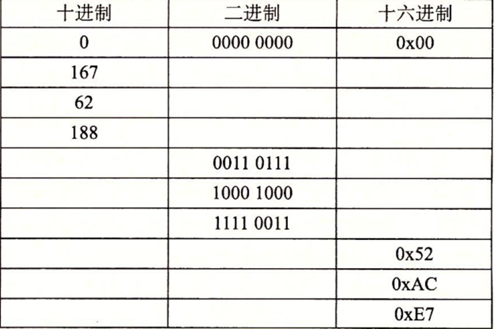

# 2.1 信息存储


持续更新中


## 练习题

### 2.1 进制转换

完成下面的数字转换：

A：将0x39A7F8转换为二进制

B：将二进制11001001011111011转换为十六进制

C：将0xD5E4C转换为二进制

D：将二进制1001101110011110110101转换为十六进制

答

我还没答呢，急啥

### 2.2 2不同次幂的进制转换

填写下表中的空白项，给出2的不同次幂的二进制和十六进制表示：

 (1).png>)

答

我还没答呢，急啥

### 2.3 进制转换

一个字节可以用两个十六进制数字来表示。填写下表中缺失的项，给出不同字节模式的十进制、二进制和十六进制值

答

我还没答呢，急啥

### 2.4 进制计算

.png>)

答

我还没答呢，急啥

### 2.5 思考下面对show\_btyes的三次调用

.png>)

.png>)

答

我还没答呢，急啥

### 2.6 使用show\_int和show\_float，我们确定整数3510593的十六进制表示为0x00359141，而浮点数3510593.0的十六进制表示为0x4A564504

.png>)

答

我还没答呢，急啥

### 2.7 下面对show\_bytes的调用将输出什么结果？

.png>)

答

我还没答呢，急啥

### 2.8 填写下表，给出位向量的布尔运算的求值结果

.png>)

答

我还没答呢，急啥

### 2.9 颜色的位向量计算

.png>)

答

我还没答呢，急啥

### 2.10 对于任何一位向量a，有a^a=0。应用这一属性，考虑下面的程序&#x20;

.png>)

答

我还没答呢，急啥

